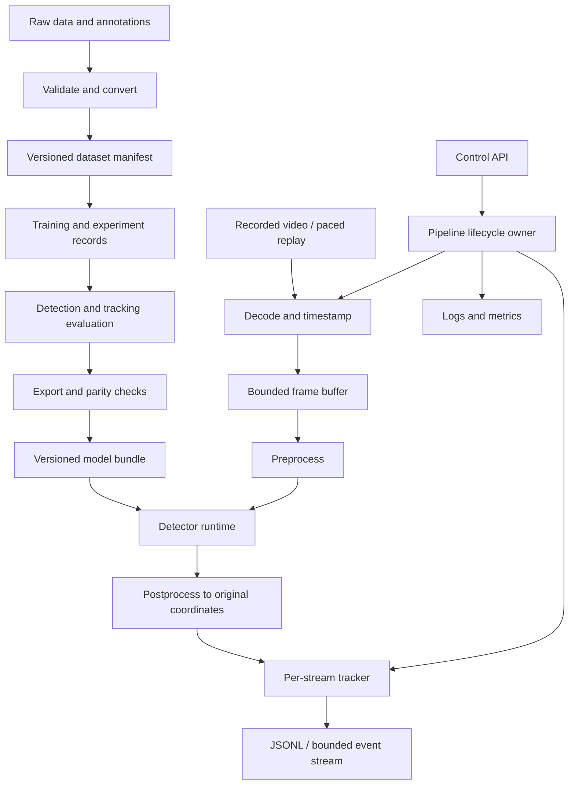

# System architecture

This is the intended architecture, not a description of implemented software. Add components only when their roadmap module needs them.

## Offline development and online inference



Start with synchronous functions in one process. Introduce concurrency only to separate source arrival from inference in module 07. Training and export are separate commands, never request handlers. A single pipeline owner serializes tracker updates and owns the accelerator; starting multiple web workers must not accidentally create multiple model copies or competing tracking states.

## Component boundaries

| Component | Responsibility | Contract / failure boundary |
| --- | --- | --- |
| Source | Decode frames and expose source timing | Emits frames, explicit EOF, or source errors |
| Preprocessor | Color/layout conversion, resize, normalize | Returns input tensor and invertible geometry metadata |
| Detector adapter | Invoke the selected model/runtime | Returns canonical detections; library-specific outputs stay inside adapter |
| Postprocessor | Thresholding, required NMS, inverse geometry | Adapter owns model-specific work; do not apply NMS twice |
| Tracker adapter | Associate detections over time | Owns stream-local IDs and lifecycle, accepts elapsed-time/reset policy |
| Sink | Persist or stream results | Explicit buffering and overflow semantics |
| Evaluator | Compare predictions and labels | Versioned class, ignore, matching, and split policies |
| Service | Validate requests and control lifecycle | No model/tracking business logic in route handlers |
| Telemetry | Measure stage and service behavior | Bounded-cardinality metrics, structured diagnostic events |

## Canonical records

Specify exact types during implementation; the intended semantics are:

- **Frame:** stream/session ID, monotonically increasing frame index, source presentation timestamp if available, monotonic ingest time, original width/height, and image. Source time and host monotonic time are separate clock domains.
- **Detection:** original-image pixel `xyxy` box, canonical class ID, and confidence. Declare continuous box edges with width `x2 - x1` and height `y2 - y1`; centralize conversions to dataset conventions. Reject invalid numeric values and inverted boxes; specify clipping consistently.
- **Track:** stream/session ID, track ID, class ID, box, association/lifecycle status, and timestamp. IDs are unique within a session, not permanent real-world identities. State whether a reported box was measured or predicted.
- **Frame result:** schema version, frame identity/times, model-bundle version, detections, tracks, and processing status. An empty successful frame differs from a failed frame.
- **Model bundle:** weights/runtime artifact, checksum, model/config versions, class mapping, input layout/dtype/shape, preprocessing/postprocessing policy, dependency/runtime requirements, and linked evaluation report.

Keep vendor-specific tensors out of the tracker and API. Resolve configuration once at startup, validate it, and save the resolved values with every run.

## Modes and overload

**Offline evaluation:** preserve every frame, order, and sequence boundary. Let the source slow down rather than dropping data. Tracking evaluation uses the complete sequence under its declared protocol.

**Paced replay:** schedule recorded frames against a monotonic clock at source cadence. A small bounded input buffer favors freshness by replacing stale queued frames. Record every discarded frame and its reason. Distinguish scheduled arrival, actual ingest, and completion so upstream lag is visible. Fix queue capacity and maximum acceptable frame age from measurements.

The output stream also has bounded buffers. A slow client must not hold tracker execution indefinitely; disconnect it or drop events under a documented policy, exposing sequence gaps. An archival JSONL sink may use backpressure in offline mode. Never call dropped event delivery “lossless.”

Tracking must account for gaps. If the selected implementation only supports fixed frame steps, document a bounded-gap policy and reset after excessive gaps rather than silently treating separated frames as adjacent.

## API and lifecycle proposal

Begin with `POST /jobs`, `GET /jobs/{id}`, `DELETE /jobs/{id}`, and `GET /jobs/{id}/events`, plus `/health/live`, `/health/ready`, and `/metrics`. A job selects a configured local source; arbitrary URLs and uploads are outside the initial interface. One active job is supported; reject excess work rather than accumulating an unbounded queue.

States: `idle → starting → running → stopping → completed`, with explicit `failed` transitions. Validate before allocating resources; release source/runtime resources and reset tracker state on termination. Readiness means a validated bundle and usable runtime are available, not simply that the HTTP process responds. Bind locally for the initial demo.

## Proposed repository layout

Create these directories when they gain real content; this is not a requirement to scaffold empty layers now.

```text
src/edgevision/       # data, detector/tracker adapters, pipeline, service, telemetry
configs/             # validated data, training, inference, benchmark configuration
tests/               # synthetic fixtures and meaningful boundary/lifecycle tests
scripts/             # thin reproducible command wrappers, not duplicated logic
docs/modules/        # module explanations and learning evidence
docs/decisions/      # architecture decision records
docs/reports/        # comparisons, failure analysis, release reports
docs/runbooks/       # operation, recovery, rollback
data/                # local ignored datasets; committed manifests live separately
artifacts/           # local ignored weights, exports, outputs, timing samples
```

Version code, configs, manifests, and small reports in Git. Keep raw data, video, weights, run databases, and generated caches outside Git. Reports must identify where larger artifacts can be obtained and how to verify them.
